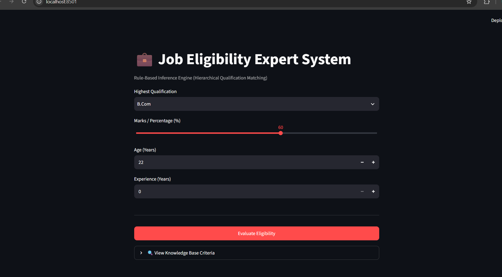
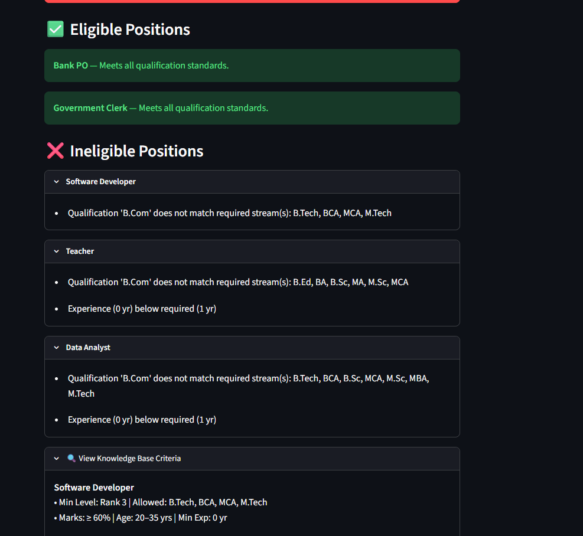
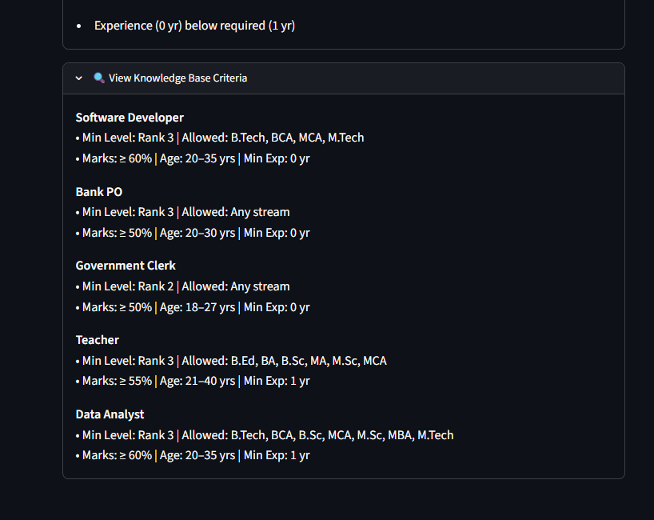

💼 Job Eligibility Expert System
A rule-based expert system built with Python and Streamlit that evaluates job seeker eligibility using a hierarchical integer-scale qualification engine.

📸 Application Preview

📌 Project Overview

Traditional job-matching logic often fails when using basic string matching (e.g., an applicant holding an M.Tech being marked ineligible for a role that lists 12th or B.Tech as a prerequisite).

This Job Eligibility Expert System solves this problem by implementing an Integer Scale Hierarchy (QUAL_LEVELS) to rank education levels. Candidates with higher degrees automatically satisfy baseline educational requirements while enforcing stream-specific prerequisites (such as technical or teaching degrees) where necessary.

✨ Key Features

Hierarchical Qualification Engine: Ranks degrees on an integer scale from level 1 (10th) to level 4 (Master's), allowing higher qualifications to satisfy lower-level baseline requirements.

Stream-Specific Filtering: Evaluates stream restrictions (e.g., B.Tech, BCA) for specialized technical roles while accepting general degrees for open roles like Bank PO or Government Clerk.

Multi-Factor Inference Rules: Simultaneously validates age boundaries, minimum percentage/marks, and required work experience.

Detailed Failure Diagnostics: Displays explicit, granular feedback on why a candidate was rejected for a given position.

Interactive Streamlit UI: Features intuitive input controls, multi-column layouts, expandable rule references, and responsive status cards.

📸 Interactive Results & Rule Breakdown

⚙️ How It Works (Inference Logic)

User Profile Input: The candidate inputs their highest qualification, marks percentage, age, and years of experience via the Streamlit dashboard.

Qualification Evaluation:

Converts the candidate's degree to an integer rank (1 <= Rank <= 4).

Verifies if candidate rank >= job min_qual_level.

If specific streams are mandated (allowed_quals), checks if candidate degree exists in the accepted list.

Threshold Validations:

Marks >= min_marks

min_age <= Age <= max_age

Experience >= min_exp

Result Aggregation: The engine classifies all system roles into Eligible or Ineligible lists with specific failure justifications.

🚀 Getting Started & Local Installation

Prerequisites

Python 3.8+ installed on your machine.

1. Clone the Repository
git clone https://github.com/Harishkumar-ghub/job-eligibility-expert-system/tree/main

    cd job-eligibility-expert-system

2. Create and Activate Virtual Environment (Optional but Recommended)

Windows:

python -m venv venv

venv\Scripts\activate

macOS / Linux:

python3 -m venv venv

source venv/bin/activate

3. Install Dependencies

pip install -r requirements.txt

4. Run the Streamlit 
Application
streamlit run app.py

The web app will automatically open in your default browser at http://localhost:8501.

📁 Project Structure

assets/             # Storage directory for UI screenshots

├── screenshot.png

├── screenshot2.png

└── screenshot3.png

.gitignore

app.py              # Core application logic (Streamlit UI + Rule-based Engine)

README.md           # Comprehensive project documentation
          

🤝 Contributing
Contributions, issues, and feature proposals are welcome! Feel free to open a pull request or submit an issue.

📝 License
This project is open-source and available under the MIT License.